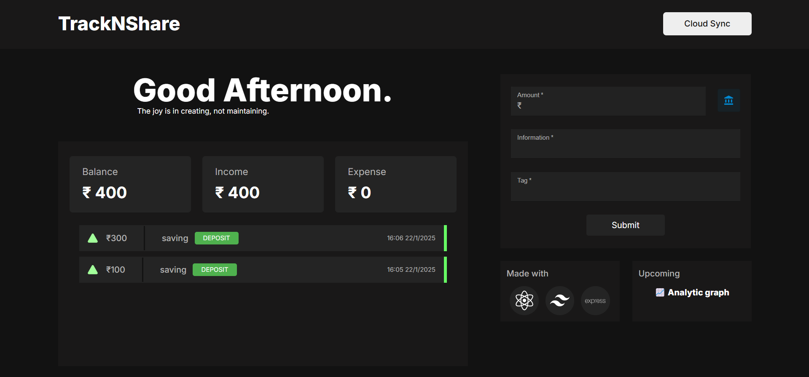

# TrackNShare

TrackNShare is a web application that allows you to track your expenses in a simple and easy-to-use way. The application is built using React and Express.js, which are two of the most popular JavaScript frameworks. This makes the application fast, reliable, and scalable.

## Frontend Technologies
- **React.js**: A JavaScript library for building user interfaces.
- **Material UI**: A popular React UI framework.
- **Tailwind CSS**: A utility-first CSS framework for styling.
- **Vite**: A build tool that improves development speed and performance.

## Backend Technologies
- **Node.js**: A runtime environment to execute JavaScript code server-side.
- **Express.js**: A web application framework for Node.js.
- **Passport.js**: Authentication middleware for Node.js.
- **MongoDB**: A NoSQL database for storing and managing data.

## Features
### 1. **Simple and Minimal User Interface**
   - A clean and intuitive user interface that allows users to manage their expenses effortlessly.

### 2. **Expense Management**
   - Users can add and delete their expenses with ease.

### 3. **Local Browser Storage**
   - Utilizes the browser's local storage to store expense data on the user's device, ensuring data persistence across sessions.

### 4. **Persistent Login System**
   - Implements a secure login system that allows users to access their expense data from any device after authentication.

### 5. **Data Synchronization**
   - For enhanced data security and a seamless user experience, local browser storage data is synchronized with the central database.

### 6. **User Authentication and Authorization**
   - Ensures that only authorized users can access the expense data and perform relevant actions.

## Screenshot
Here is a screenshot of the TrackNShare application:

